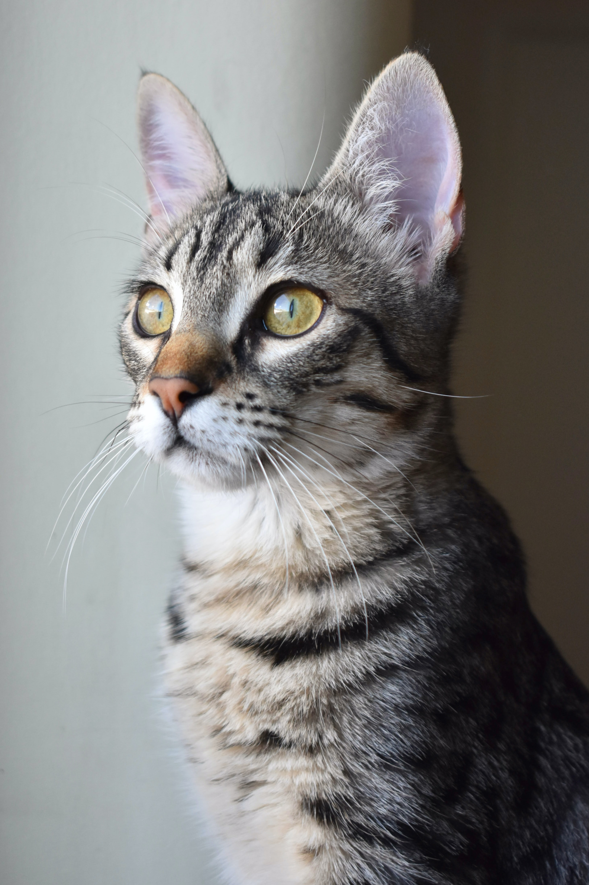
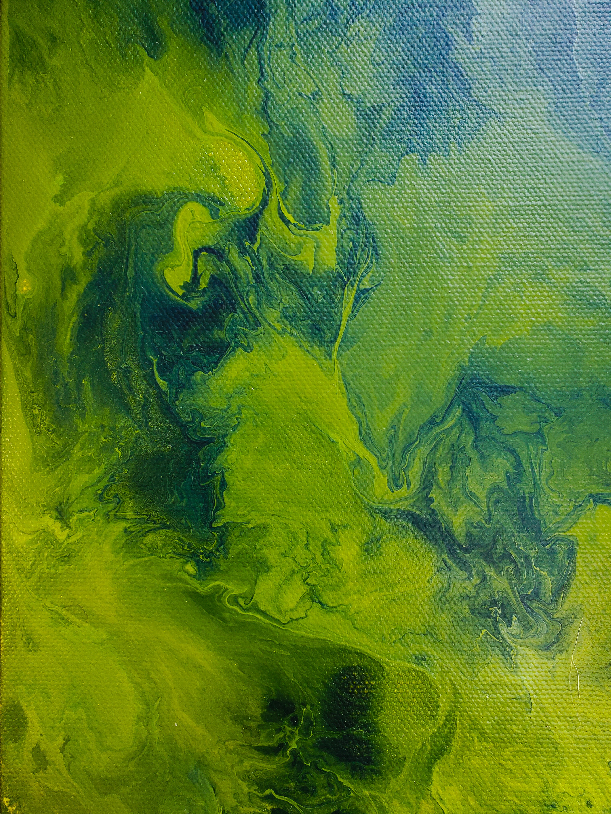
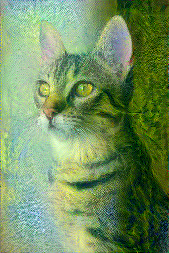
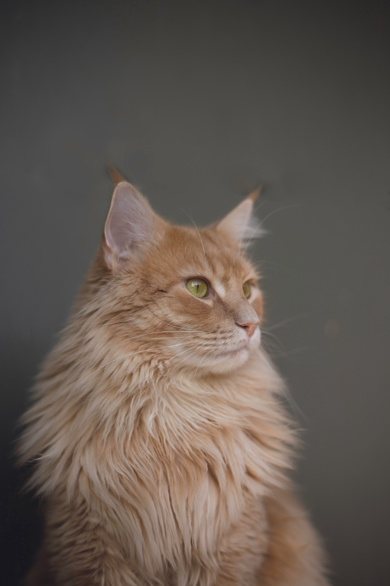
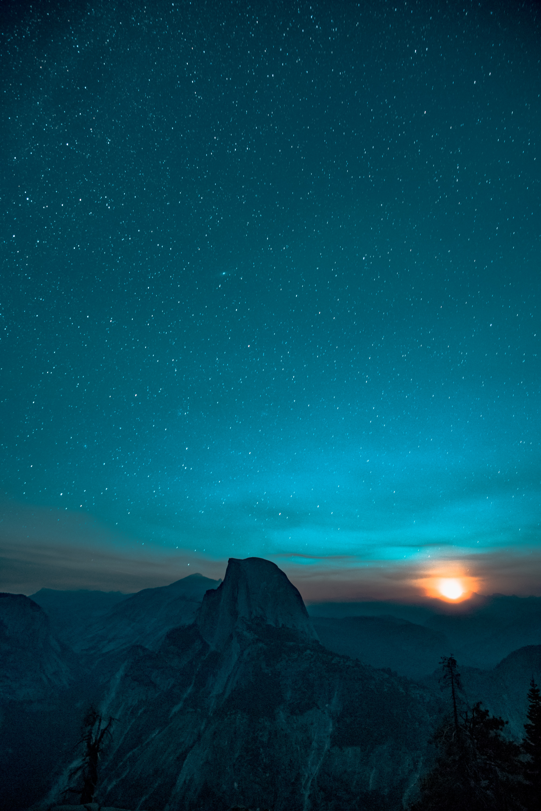
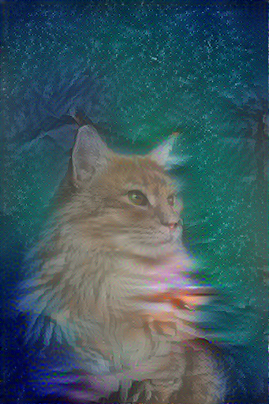

## Neural Style Transfer

Tensorflow implementation of Neural Style Transfer - using VGG19

### Results
<table>
  <tr>
    <td>Content Image</td>
     <td>Style Image</td>
     <td>Generated Image</td>
  </tr>
  <tr>
    <td></td>
    <td></td>
    <td></td>
  </tr>
  <tr>
    <td></td>
    <td></td>
    <td></td>
  </tr>
 </table>
